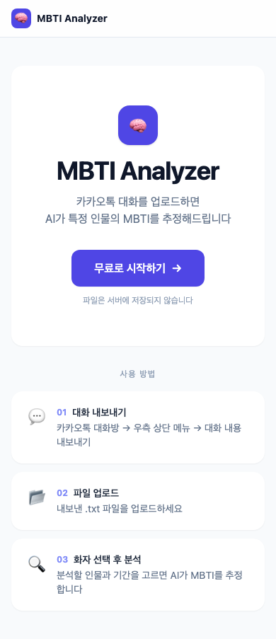
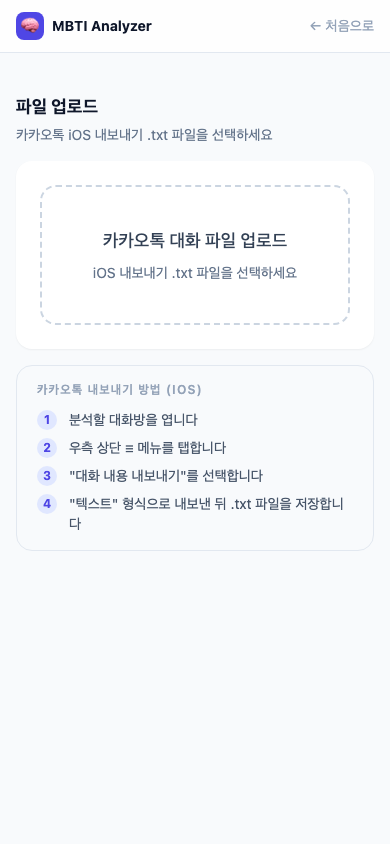

# 🧠 MBTI Analyzer

> 카카오톡 대화 파일을 업로드하면, AI가 특정 인물의 MBTI를 추정하고 근거 보고서를 작성해줍니다.

<div align="center">
  
  &nbsp;&nbsp;
  
</div>

---

## 어떤 서비스인가요?

카카오톡 대화를 `.txt` 파일로 내보내면, AI(로컬 LLM)가 대화 패턴을 분석해 특정 화자의 MBTI를 추정합니다.

- **E vs I** — 먼저 연락하는 빈도, 대화 주도성
- **S vs N** — 구체적 묘사 vs 아이디어/가능성 중심 표현
- **T vs F** — 문제 앞에서 해결책 vs 공감 반응
- **J vs P** — 계획·약속 언급, 즉흥성

분석 결과는 마크다운 보고서로 제공되며, **이미지로 공유하거나 다운로드**할 수 있습니다.

> 업로드한 파일은 서버에 저장되지 않습니다. 모든 처리는 로컬에서 이루어집니다.

---

## 실행 환경

| 항목 | 버전 |
|---|---|
| Python | 3.11 이상 |
| Node.js | 18 이상 |
| Ollama | 최신 버전 |
| LLM 모델 | gemma4:e2b (약 8GB) |

---

## 설치

### 1. 저장소 클론

```bash
git clone https://github.com/yechan928/mbti-analyzer.git
cd mbti-analyzer
```

### 2. Ollama 설치 및 모델 다운로드

[ollama.com](https://ollama.com) 에서 Ollama를 설치한 뒤 모델을 받아주세요.

```bash
ollama pull gemma4:e2b
```

### 3. 백엔드

```bash
cd backend
python -m venv .venv
source .venv/bin/activate       # Windows: .venv\Scripts\activate
pip install -r requirements.txt
```

### 4. 프론트엔드

```bash
cd frontend
npm install
```

---

## 실행

터미널 3개를 열어 각각 실행합니다.

**터미널 1 — Ollama**
```bash
ollama serve
```

**터미널 2 — 백엔드**
```bash
cd backend
source .venv/bin/activate
uvicorn main:app --reload
```

**터미널 3 — 프론트엔드**
```bash
cd frontend
npm run dev
```

브라우저에서 http://localhost:5173 접속

---

## 사용 방법

### 1단계 — 카카오톡 대화 내보내기 (iOS)

1. 분석할 카카오톡 대화방 열기
2. 우측 상단 **≡ 메뉴** 탭
3. **대화 내용 내보내기** 선택
4. **텍스트** 형식으로 내보내기 → `.txt` 파일 저장

### 2단계 — 분석

1. http://localhost:5173 접속 후 **무료로 시작하기** 클릭
2. 내보낸 `.txt` 파일 업로드
3. 분석할 **화자** 선택
4. **분석 시작일** 선택 (범위 안내에 따라 선택)
5. **분석하기** 클릭 → AI가 보고서를 실시간으로 작성

### 3단계 — 결과 확인

- MBTI 4글자 코드 + 축별 근거 보고서 제공
- **공유하기** — 이미지로 캡처해 기본 공유 시트 오픈 (iOS)
- **다운로드** — PNG 파일로 저장
- **복사하기** — 텍스트 클립보드 복사

---

## 제약사항

- iOS 카카오톡 내보내기 형식만 지원 (Android 미지원)
- 분석 대상 화자의 메시지가 **20개 이상** 필요
- 분석 소요 시간: 로컬 환경에 따라 **1~2분** (Mac M 시리즈 기준)

---

## 기술 스택

| 영역 | 기술 |
|---|---|
| 프론트엔드 | React, TypeScript, Vite, Tailwind CSS |
| 백엔드 | FastAPI, Python |
| AI | Ollama (gemma4:e2b), SSE 스트리밍 |
